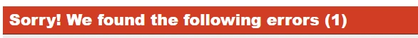

# Health Check

[View Website](https://rusjamison.github.io/health-check/  "Health Check")

Health Check is the site which informs and encourages the public to monitor their health at home. The main focus is on the High Blood Pressure which is a silent killer. Two out of three people over the age of 50 years has High Blood Pressure and if unchecked could be fatal. Early detection is the key and technology is on our side.

- We are the most fortunate and informed habitants to live on planet earth.

- Integrated Circuits (IC) technology has improved greatly over the past ten years, making medical equipment accurate, smarter, reliable and easy to use in home setting.

To minimize unnecessary visits to the doctors for our aging population the basic patient vital monitoring can now be done easily at home. The availability of basic medical equipment which is affordable, cheap and equally acurate can be easily used and results shared with doctors using remote monitoring. Since information storage is now cheap also due to IC technology the patient vital signs measurements can be stored and shared with doctors during the next visit. This wealth of information will assist the doctors to come with better outcomes for the patient.

## Table of Contents

* [User Experience](#user-experience)
* [Features](#features)
* [FutureFeatures](#future-features)
* [Deployment](#deployment)
* [Testing](#testing)
* [Technologies Used](#technologies-used)
* [Credits](#credits)

## User Experience

### User Stories

* #### First Time Visitor Goals
    * As a First Time Visitor, I want to see what can I benefit from the website
    * As a First Time Visitor, I want to navigate throughout the site easily
    * As a First Time Visitor, I want to find short, reliable and accurate information
    * As a First Time Visitor, I want to learn new information quickly
    * As a First Time Visitor, I want to be able to apply what the site offer

* #### Returning visitor Goals
    * As a returning Visitor, I want to find more helpful information
    * As a returning Visitor, I want to find response to my requests and comments.
    * As a returning Visitor, I want to view other people testinomials.
    * As a returning Visitor, I want to view menu to helpful resources easily.
    * As a returning Visitor, I want to view latest information on the subject.

* ### Frequent Visitor Goals
    * As a Frequent Visitor, I want to see more and new resources.
    * As a Frequent Visitor, I want to see new additions which benefit the users.

## Features

### Existing Features

* Navigation Bar

    * The Navigation bar appears on all three pages, namely Home, Resources and Signup for easy movement from one page to another without using the back key.

    

* The Landing Page Image

    * The landing image includes the text information on the dangers of high blood pressure.
    * The image text gives statistics that about two out of three people over the age of 50 have some sort of high blood pressure.
    * The text also includes the action to take at home, monitor your blood pressure.

    

    * The landing Page section and aside which includes
        * Taking advantage of useful information on High Blood Pressure available to us.
        * Taking advantage of cheap medical equipment available on the market now due to technology breakthrough.
        * Address the reluctance of some groups of society not willing to visit doctors clinics.

* The Footer
    * The Footer appears on all three pages, namely Home, Resources and Signup for easy movement from one page to the social media link related to Health Check Monitoring.
    * The Footer is very important to the users as it encourage to keep them connected and take away some stresses which contribute to High Blood Pressure.

    

* Resources Page
    * Focus on what is High Blood Pressure and the correct way of measuring Blood Pressure.
    * You Tube from Health Sketch team of doctors in England promoting good health care using media, it is follow the patient using internet.
    * High Blood Pressure explained in simple language for anyone to understand, short and simple to the point.
    * The Resources page takes into account users engages for a short time on a topic before getting bored.

    

    [To view above Resources visit Website](https://rusjamison.github.io/health-check/  "Health Check") 

    * The Resources Page after describing what is High blood Pressure gives information on the correct measurement of Blood Pressure at home.
    * High Blood Pressure is a Silent Killer so the proper measurent is encouraged. If not carried properly your measurement can be 10 units out which might take you out of High Blood Pressure region when you actually have High Blood Pressure.
    * The Arm Position for taking Blood Pressure explains this in detail is a short You Tube video

    

    [To view above Resources visit Website](https://rusjamison.github.io/health-check/  "Health Check")

* The Sign-up Page
    * The Sign-up Page allows the user/vistor to comment, request or leave a testimonial if there is need for the user/visitor to do.
    * The user need to sign with their name, email and password to comment, request and leave testimonial. The need of password is due to the nature of information we are dealing with, Data Protection is key for the users/visitors information.
    
    

    * To acknowledge the submission of the form by the user a message with input details pops on the screen (Meanwhile the formdump.codeinstitute.net page with the data submitted displayed)

    

### Future Features

* Vital Signs Page
    * Apart from High Blood Pressure, everyone over 40 years is encouraged to know their cholesterol levels. This test can be easily carried at home.
    * It is good health check practise to know your oxygen level, heart rate (pulse) temperature, weight and respiratory rate (breathing rate). All these tests can be easily now carried at home due to cheap and reliable equipment.

* Connectivity and Storage
    * Having data but not using it is useless.
    * In the future once you are signed you have the option to link your vital signs trend with your doctor or community clinic.
    * Alarm limits are set on the readings and once the readings are above or below set limits your doctor or community clinic is notified who will in turn take action by encouraging health living or carry further checks.
    * Another option is just allow you to store your results and share with them the next time you visit your doctor.
* Clinical Engineers
    * A team of clinical engineers will have a dedicated page to deal with equipment recommended for use at home.
    * Work with doctors and nurses to implement this.

## Deployment

    Open your repositories on GitHub
    Select health check

    Select settings
    Select Pages

    Make sure source is Deploy from Branch

    Select main for branch and folder for root then click save

    Your site lives at https://rusjamison.github.io/health-check/

### Run Project Locally
    
    Clone project into Gitpod
        GitHub account. [Create GitHub Account](https://github.com)
    
    1. Install [Gitpod Extension for Chrome](https://gitpod.io/docs/browser-extension/)
    2. Use your Gitpod account to [Log into Gitpod](https://gitpod.io)
    3. [Health Check project repository](https://github.com/RusJamison/health-check.git)
    4. Create gitpod workspace.
        Click the "Code" button to the right of the screen, click HTTPs and copy the link there
        Open a GitBash terminal and navigate to the directory where you want to locate the clone
        On the command line, type "git clone" then paste in the copied url and press the Enter key to begin the clone process

    
    

## Testing

### Browser Compatibility

* Testing carried on these browsers
    * Chrome
    * Edge
    * Android

* Feature Testing

| Feature        | Steps                                                                          | Outcome                                                                | Results |
| -------------- | ------------------------------------------------------------------------------ | ---------------------------------------------------------------------- | ------- |
|                |                                                                                |                                                                        |         |
| Navigation Bar | Click Home, Resources and Sign-up Links                                        | Links response and open appropriate links                              | Pass    |
|                |                                                                                |                                                                        |         |
| Responsiveness | All features test carried on desktops, tablets and mobiles                     | Test on mobile, laptop ,tablets and screens to 1800px okay             | Pass    |
|                |                                                                                |                                                                        |         |
| Footer         | Click on Facebook, Twitter and YouTube links                                | Links response and open appropriate pages                              | Pass    |
|                |                                                                                |                                                                        |         |
| Links on pages | Click on any links on pages                                                    | All links open to appropriate pages                                    | Pass    |
|                |                                                                                |                                                                        |         |
| Landing Page   | Check user experince, Check for positioning, colours and  readabity of text | Check for positioning, colours and readabity of text all clear         | Pass    |
|                |                                                                                |                                                                        |         |
| Footer         | User Experience check on all pages                                             | Look the same on all pages, forced to the bottom and is to  be seen | Pass    |
|                |                                                                                |                                                                        |         |
| Form Sign-up   | Complete all fields and submit form                                            | Acknowlegement form submitted                                          | Pass    |
|                |                                                                                |                                                                        |         |
| Form name      | Try send form with no name                                                     | Please fill out the field fail because name is a must field            | Pass    |
|                |                                                                                |                                                                        |         |
| Form surname   | Try send form with no surname                                                  | Please fill out the field fail because surname is a must field         | Pass    |
|                |                                                                                |                                                                        |         |
| Form email     | Try send incomplete email                                                      | Please include '@' in the email address                                | Pass    |
|                |                                                                                |                                                                        |         |
| Form password  | Try leave the field empty                                                      | Please fill this field                                                 | Pass    |

### Validator Testing

[HTML Validator](https://validator.w3.org)

    Results for index.html

    Results for sign-up.html

[CSS Validator](https://jigsaw.w3.org/css-validator/)

    CSS Results with error

    CSS Results after correcting line 118

    Landing Page Lighthouse Results

## Technologies Used

    HTML5
    CSS3

    Git
    GitHub

    Balsamiq

    Google fonts
    Font Awesome

    Visual Studio Code
    Markdown

## wireframe

### Landing Page

### Resources Page

.webp)

### Signup Page

## Credits

    The Code Institute Learning Platform, Learning Management System (LMS) was the main basis of my codes for this project mainly from the Coders Coffeehouse project and Love Running.

    Thanks to Amy Richardson for the resources she gave us during the course of this project.

    Thanks to my mentor Brian Macharia for his mentoring sessions, guidance, patience, encouragement and constant motivation throughout the project.

### Content
Irish High Blood Pressure Statistics (https://irishheart.ie/your-health/our-health-programmes/healthy-communities/mobile-health-unit/)

Why men avoid going to the doctors (https://www.healthline.com/health-news/why-so-many-men-avoid-doctors?c=62125905332)

IC Technology in medical equipment (https://www.avnet.com/wps/portal/apac/resources/article/ic-technology-in-medical-equipment/)

NHS Health Check (https://www.nhs.uk/conditions/nhs-health-check/)

Frequency of checks (https://www.emedicinehealth.com/checkup/article_em.htm)

Flex codes (https://coder-coder.com/build-flexbox-website-layout/)

Nav (https://tutorials.shecodes.com.au/html_and_css/4_structure/3_nav/)

Flex (https://tutorials.shecodes.com.au/html_and_css/4_structure/3_nav/)

Navigation bar code(https://www.linkedin.com/learning/html-and-css-linking/creating-a-simple-vertical-navigation-bar)

README.md (Love Running Code and Coding Club project Institute Learning Management System)(https://learn.codeinstitute.net/courses/course-v1:CodeInstitute+CSSE_PAGPPF+2021_Q2)

README.md(https://github.com/elainebroche-dev/ms1-thrive/)

Future Features (https://www.letsgetchecked.ie/home-sti-test/?clickid=SUQyxcSijxyPTNE2IdUp23P9UkHRJxzRNweVVw0&utm_source=impact&utm_medium=affiliates&utm_campaign=8695&utm_content=Online%20Tracking%20Link_ONLINE_TRACKING_LINK_&utm_term=1999899_Healthline%20Media&irgwc=1)

### Media
WEBP conversion (https://picflow.com/convert/png-to-webp)

Hero image (https://www.pexels.com/)

Favicon (https://www.flaticon.com/free-icon/cardiogram_249205)

High Blood Pressure (https://bloodpressureexplained.com/category/high-blood-pressure/)

HealthSketch ( https://support.google.com/youtube/answer/171780?hl=en-GB )

Arm position during Blood Pressure measurement (https://www.youtube.com/watch?v=948kp1XNTq0&list=PL42A8vXJeY0ZEQpmCM1ajHnYIXyDdjd-z&index=15)

    

